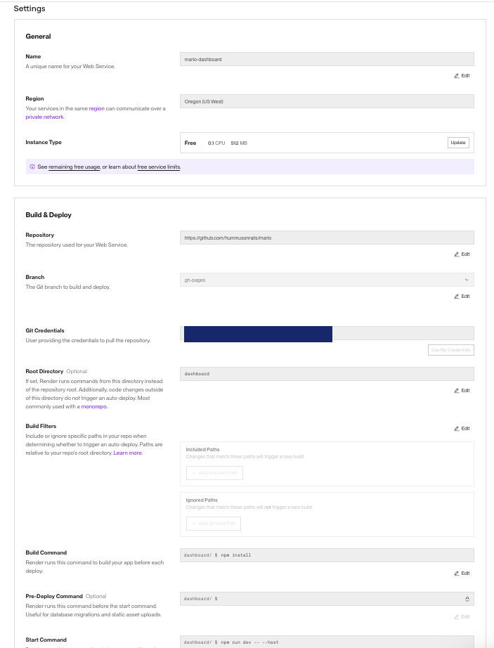
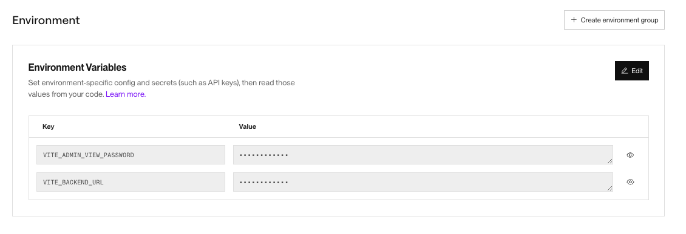

# Frontend Setup

This directory contains the React-based frontend dashboard for displaying the leaderboard of the Mario game, the player sign-up form, and an administrative interface for the event team.

## Requirements

* [Backend server URL](../server/)

## Setup Instructions

### Step 1: Install Dependencies

Navigate to the `/dashboard` directory and run:

```bash
npm install
```

### Step 2: Configure Environment Variables

Copy the provided `.env.sample` file to `.env` and fill in the required values:

```bash
cp .env.sample .env
```

Edit the `.env` file with the URL of the backend server and a password to view the admin dashboard:

```bash
VITE_BACKEND_URL=http://your-backend-url.com
VITE_ADMIN_VIEW_PASSWORD=your-secure-password
```

### Step 3: Start the Development Server

Start the development server using:

```bash
npm run dev
```

Your frontend dashboard will be running on `http://localhost:5173` by default.

## Dashboard URLs

The dashboard provides three primary URLs:

* **Main Leaderboard**: `http://localhost:5173/`
* **Player Sign-Up Form**: `http://localhost:5173/form`
* **Admin Dashboard**: `http://localhost:5173/admin`

### Administrative Interface

The admin dashboard or interface provides event organizers access to:

* View the player data stored in Couchbase
* Delete any individual player data
* Download the player data as a CSV file to import into any further tools
* Delete all player data after the event is over

## Deployment to the Cloud

### Deploy to Render Instructions

1. Create a new web service on [Render](https://render.com).
2. Connect your GitHub repository through the dashboard.
3. Fill out the Settings with the following in the Render dashboard for the project:
    - **Branch**: `gh-pages`
    - **Root Directory**: `dashboard`
    - **Build Command**: `npm install`
    - **Start Command**: `npm run dev -- --host`



4. Add the environment variables from your `.env` file in the Render dashboard under **Environment**. Render provides the option to copy and paste them directly from your `.env` file into their web dashboard or simply upload the `.env` file.



5. The deployment will start automatically. Copy the main URL of the deployed frontend. Now you can access the dashboard from going to the main URL, the admin interface by adding `/admin` to the URL, and the player sign-up form by adding `/form` to the URL.
