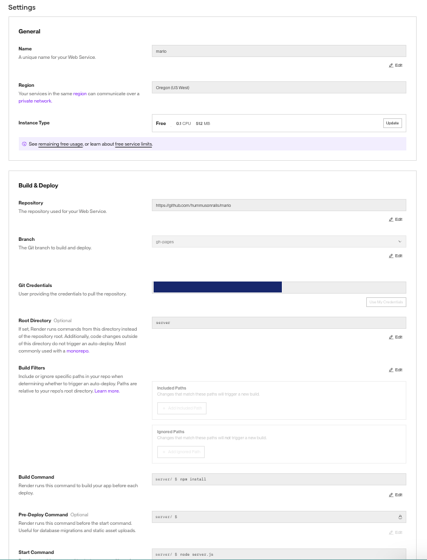
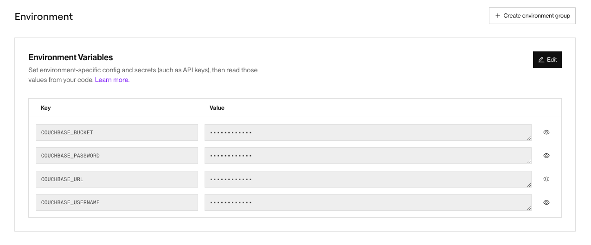

# Express Server for Mario Game

This directory contains the Express backend server that interacts with Couchbase and the frontend leaderboard for the Mario game. The server handles player data, game events, and provides an API for the frontend to fetch and display game data.

## Requirements

* Access to a [Couchbase Capella](https://cloud.couchbase.com/) cluster.

## Setup Instructions

### Step 1: Install Dependencies

Navigate to the `/server` directory and run:

```bash
npm install
```

### Step 2: Configure Environment Variables

Copy the provided `.env.sample` file to `.env` and fill in the required values:

```bash
COUCHBASE_URL=your-couchbase-url
COUCHBASE_USERNAME=your-couchbase-username
COUCHBASE_PASSWORD=your-couchbase-password
COUCHBASE_BUCKET=your-couchbase-bucket-name
```

### Step 3: Start the Server

Start the server using:

```bash
node server.js
```

Your backend server will be running on `http://localhost:3000` by default. You can change the port in the `server.js` file if needed.

## Deployment to the Cloud

### Deploy to Render Instructions

1. Create a new web service on [Render](https://render.com).
2. Connect your GitHub repository through the dashboard.
3. Fill out the Settings with the following in the Render dashboard for the project:
    - **Branch**: `gh-pages`
    - **Root Directory**: `server`
    - **Build Command**: `npm install`
    - **Start Command**: `node server.js`



4. Add the environment variables from your `.env` file in the Render dashboard under **Environment**. Render provides the option to copy and paste them directly from your `.env` file into their web dashboard or simply upload the `.env` file.



5. The deployment will start automatically. Copy the URL of your deployed service once it's up and running. You will need it for the rest of the game configuration.
